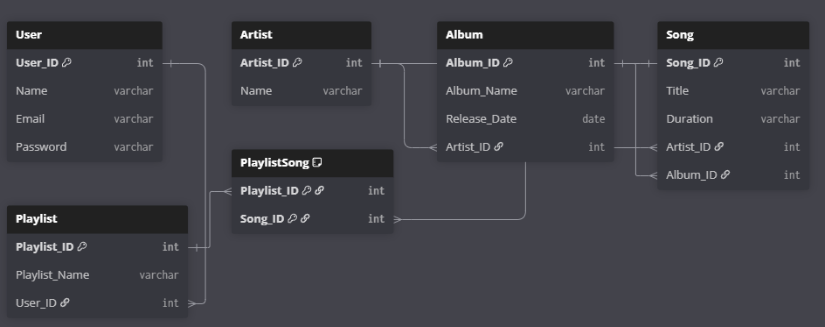

# 🎵 Music Streaming Player Database

A relational database built in **SQL Server** for a music streaming platform, managing users, songs, artists, albums and playlists.

## 📌 Overview
Music streaming apps need to store a large, connected collection of data — who the users are, which songs belong to which artists and albums, and what each user adds to their playlists. This database organizes all of that into a clean relational structure and uses SQL to search songs, manage playlists and generate reports.

## 🗂️ Database Design

- Normalized relational schema
- Primary keys, foreign keys and constraints for data integrity
- Many-to-many relationships (e.g. songs ↔ playlists)

## ⚙️ Features
- **CRUD operations** – add, update, delete and view users, songs, albums and playlists
- **Joins** – combine songs, artists and albums for detailed views
- **Queries & Reports** – search songs, list playlist contents and view listening data
- **Stored Procedures & Triggers** – reusable logic and automatic actions on data changes

## 🛠️ Tech Stack
- Microsoft SQL Server
- T-SQL

## 📄 Documentation
Full project report: [project-report.pdf](project-report.pdf)

## 👩‍💻 Author
**Iqra** – BS Computer Science, Iqra University, Karachi
[LinkedIn](https://www.linkedin.com/in/iqra-sattar-78a47143a)tform covering users, songs, artists, albums and playlists.
